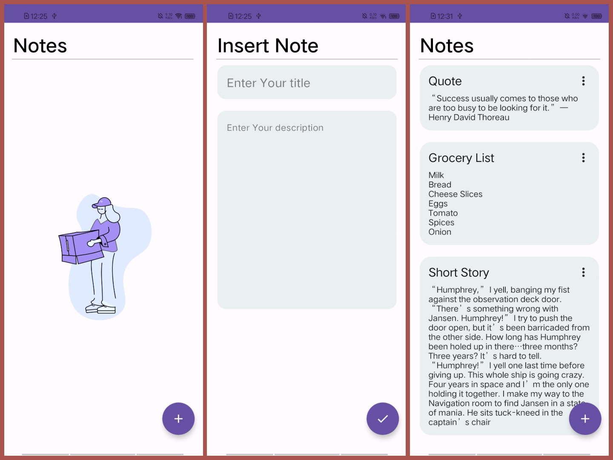
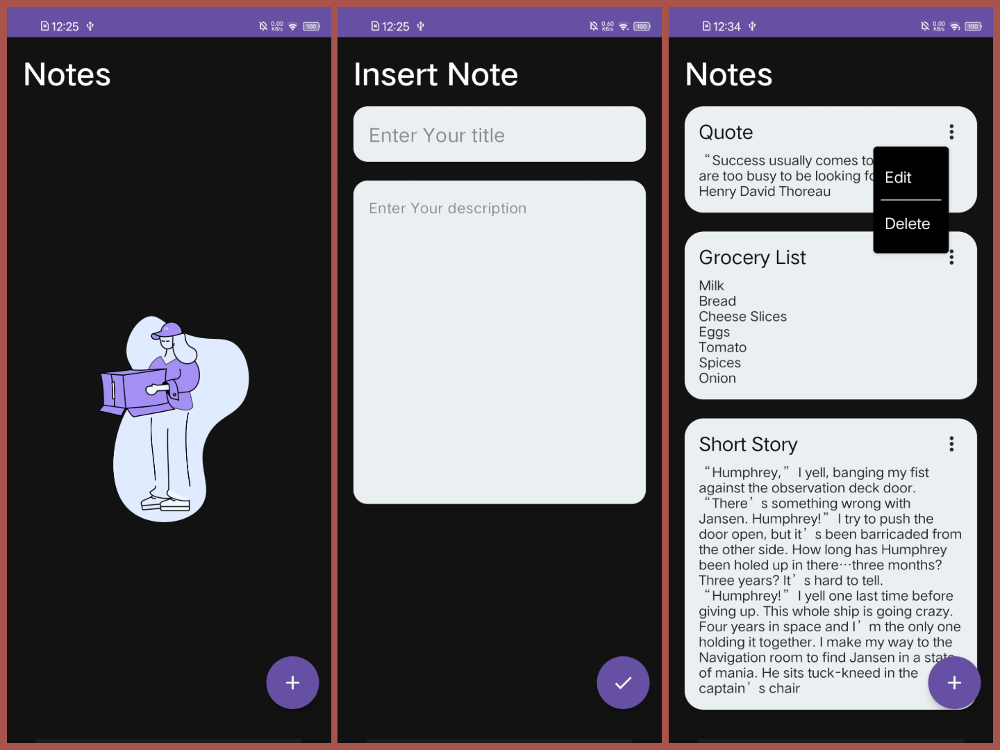

# 📝 **Notes App** 

A modern, intuitive, and easy-to-use Notes App built with **Jetpack Compose** and **Firebase Firestore**. This app allows users to create, view, edit, and delete notes. With real-time sync using Firestore, your notes are always up to date across all devices. 🔄

---

## ✨ Features

- **Real-time Sync**: 🌐 Automatically syncs notes across all devices using Firebase Firestore.
- **Add Notes**: ➕ Create new notes with a title and description.
- **Edit Notes**: ✏️ Update existing notes with ease.
- **Delete Notes**: 🗑️ Remove notes you no longer need.
- **No Data Animation**: 🎬 A smooth animation displayed when there are no notes.
- **Simple UI**: 🎨 A clean, minimalist design for an optimal user experience.
- **Responsive Design**: 📱 The app is fully optimized for various screen sizes and devices.

---

## 💻 Tech Stack

- **Jetpack Compose**: ⚙️ Modern UI toolkit for building native Android apps.
- **Firebase Firestore**: 🗄️ A cloud database for real-time data storage and sync.
- **Lottie**: 💫 For animated UI elements and transitions.

---

## 📸 Screenshots

Here’s a sneak peek into the app:





## 🚀 Installation

Follow these simple steps to get the app up and running:

1. **Clone the repository**:
   ```bash
   git clone https://github.com/kdhyani200/NotesApp.git

2. Open the project in Android Studio. 📱

3. Sync the project with Gradle. 🔄

4. Set up Firebase in your Android project:
    Go to the Firebase Console. 🌟
    Create a new project and add your Android app.
    Follow the instructions to download the google-services.json file and place it in the app/ directory. 🗂️
5. Run the app on an emulator or physical device. 🎮

🤝 Contributing
We welcome contributions! 🎉 If you'd like to improve this app, feel free to fork the repository, create a new branch, and submit a pull request. 🔄

📜 License
This project is licensed under the MIT License - see the LICENSE file for details. 📑

📧 Contact
If you have any questions, feel free to reach out to me via GitHub Issues. 📬
